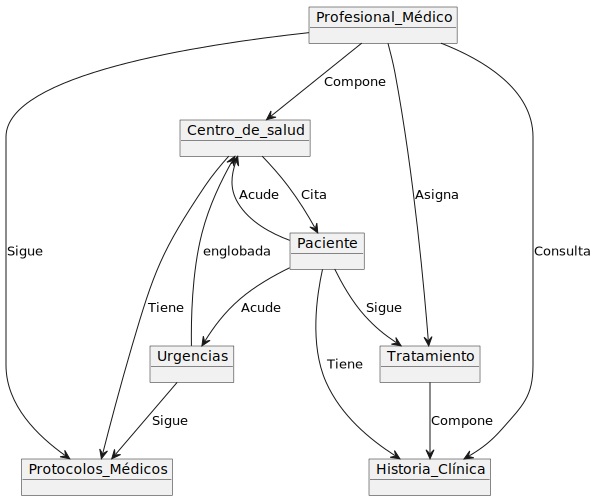
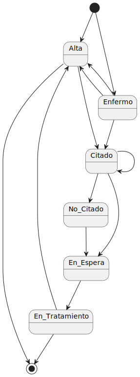
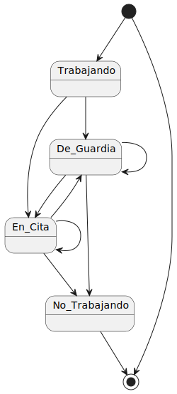
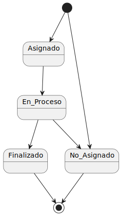
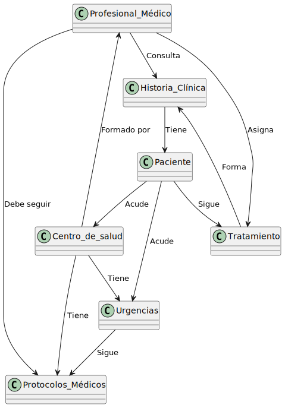

# Documento del examen de ayer completo:

[📝Examen📝](documents/Examen.pdf)

# Modelo del dominio del examen

## [📦Diagrama de entidades📦](modelosUML/Examen/DdEn.puml)

## Diagramas de estados

### [😷Paciente😷](modelosUML/Examen/DdEs_Paciente.puml)

### [👨‍⚕️Profesional Médico👨‍⚕️](modelosUML/Examen/DdEs_Profesional_Médico.puml)

### [💊Tratamiento💊](modelosUML/Examen/DdEs_Tratamiento.puml)

## [👩‍🏫Diagrama de clases👩‍🏫](modelosUML/Examen/DdC.puml)

# Modelo de dominio Revisado

